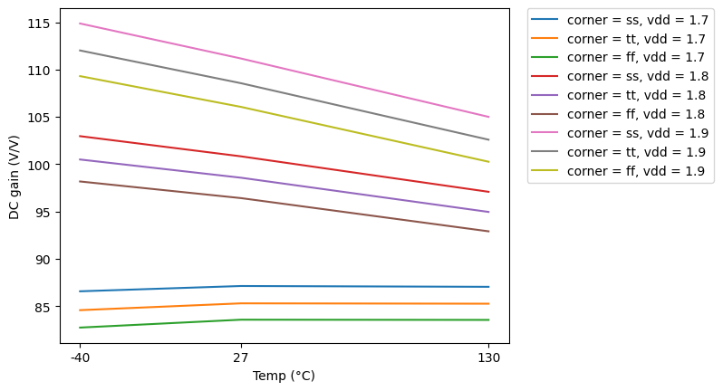
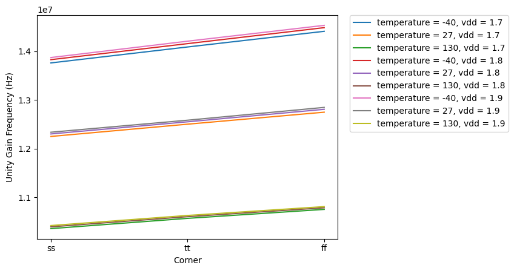
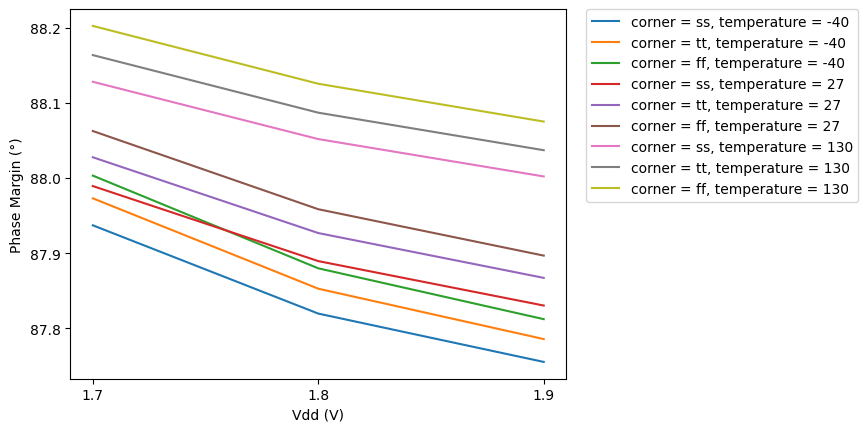
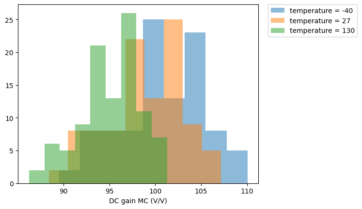
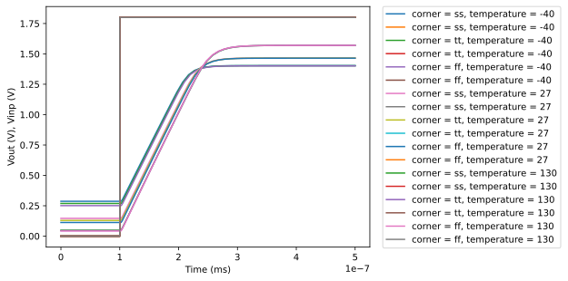

# CACE Summary for ota_5t

**netlist source**: rcx

|      Parameter       |         Tool         |     Result      | Min Limit  |  Min Value   | Typ Target |  Typ Value   | Max Limit  |  Max Value   |  Status  |
| :------------------- | :------------------- | :-------------- | ---------: | -----------: | ---------: | -----------: | ---------: | -----------: | :------: |
| DC gain              | ngspice              | a0                   |          50 V/V | 82.732 V/V |          any | 98.171 V/V |          any | 114.868 V/V |   Pass ✅    |
| Unity Gain Frequency | ngspice              | ugf                  |          1e6 Hz | 10360400.000 Hz |          any | 12551100.000 Hz |          any | 14529500.000 Hz |   Pass ✅    |
| Phase Margin         | ngspice              | pm                   |            60 ° |   87.755 ° |          any |   87.973 ° |          any |   88.202 ° |   Pass ✅    |
| DC gain MC           | ngspice              | a0                   |          50 V/V | 86.255 V/V |          any | 98.076 V/V |          any | 110.050 V/V |   Pass ✅    |
| Area                 | magic_area           | area                 |               ​ |          ​ |            ​ |          ​ |      600 µm² | 162.518 µm² |   Pass ✅    |
| Width                | magic_area           | width                |               ​ |          ​ |            ​ |          ​ |          any |   9.720 µm |   Pass ✅    |
| Height               | magic_area           | height               |               ​ |          ​ |            ​ |          ​ |          any |  16.720 µm |   Pass ✅    |
| Magic DRC            | magic_drc            | drc_errors           |               ​ |          ​ |            ​ |          ​ |            0 |          0 |   Pass ✅    |
| Netgen LVS           | netgen_lvs           | lvs_errors           |               ​ |          ​ |            ​ |          ​ |            0 |          0 |   Pass ✅    |
| KLayout DRC feol     | klayout_drc          | drc_errors           |               ​ |          ​ |            ​ |          ​ |            0 |          0 |   Pass ✅    |
| KLayout DRC beol     | klayout_drc          | drc_errors           |               ​ |          ​ |            ​ |          ​ |            0 |          0 |   Pass ✅    |
| KLayout DRC full     | klayout_drc          | drc_errors           |               ​ |          ​ |            ​ |          ​ |            0 |          0 |   Pass ✅    |

## Plots

## gain_vs_temp

## ugf_vs_corner

## pm_vs_vdd

## gain_mc

## transient

